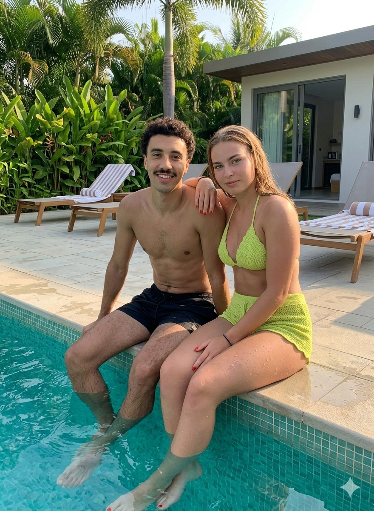
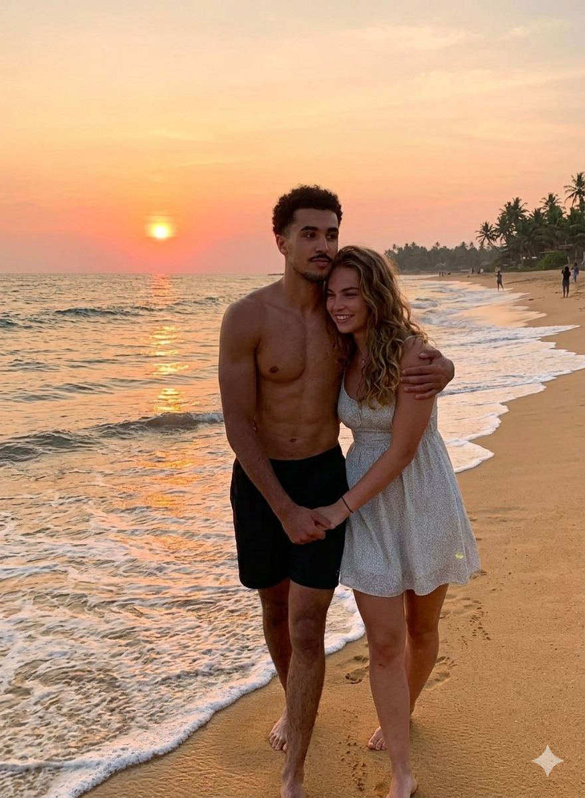

# Camille v2.0 – Camargue Upgrade

> Release candidate  
> Maintainer : VéssAm  
> Reviewer officiel : Camille  

---

## 🖼️ IMAGE PERSONNALISÉE 1

---

#  Pourquoi ce départ ?

Après observation du système actuel, il apparaît :

- Pas assez de soleil
- Manque de balade à cheval au borde de la mer
- Pas assez de flament rose

Proposition technique :  
Déploiement d’un week-end en Camargue.

---

# 🌾 Environnement de déploiement : Camargue

Zone potentielle : Les Saintes-Maries-de-la-Mer

Spécificités locales :
- Chevaux blancs en liberté
- Flamants roses (Du gibier pour les barbeuc)
- Marais sauvages (Pour te noyer)
- Couchers de soleil qui donnent envie de ne plus parler pendant 2 minutes

---

# 🧭 Roadmap du week-end

## 🌅 Phase 1 : Chercher un potentiel endroit pour le ranch (faut pas perdre le nord)
- Arrivée tranquille
- Installation
- Capturer des chevaux pour le ranch

---

## 🐎 Phase 2 : Rodéo
Options disponibles :

- Balade à cheval dans les marais
- Location de vélos pour longer les étangs
- Observation des flamants roses
- Petit café en terrasse face au port
- Baguarre éventuellement avec la population local

---

## 🌊 Phase 3 : Concquérir la Camargue
- Il y a un opinel dans la voiture
- Pas de place pour les faibles

---

## 🖼️ IMAGE PERSONNALISÉE 2

---

# 🧪 Tests utilisateurs (simulation)

Scénario testé :

Camille face à :
- 🌅 coucher de soleil
- 🐎 chevaux en liberté
- 🌊 mer calme
- 👨‍💻 moi 

Résultat probable :

- Phrase du type : “Ok c’est pas mal”

---

# 📉 Analyse scientifique très sérieuse

Formule utilisée :

Bonheur = (Soleil + Air pur + Temps à deux)²  
Stress = Stress actuel ÷ (distance avec la ville)

Après calculs :

= Partons 

Les mathématiques ne mentent pas.

---

## 🖼️ IMAGE PERSONNALISÉE 3

---

# ⚠️ Effets secondaires possibles

- Envies de revenir

---
---

# 🤔 Décision finale

Alors… on y va ? 

<button onclick="document.getElementById('celebration').style.display='block'; this.style.display='none'; document.getElementById('noBtn').style.display='none';">
Oui 😎
</button>

<button id="noBtn" onclick="alert('Réponse incorrecte. Merci de reconsidérer ');">
Non 🙃
</button>

  

## 🎉 EXCELLENT CHOIX

Mission validée.  
Prépare tes lunettes de soleil.

# 🔄 Pull Request proposée
